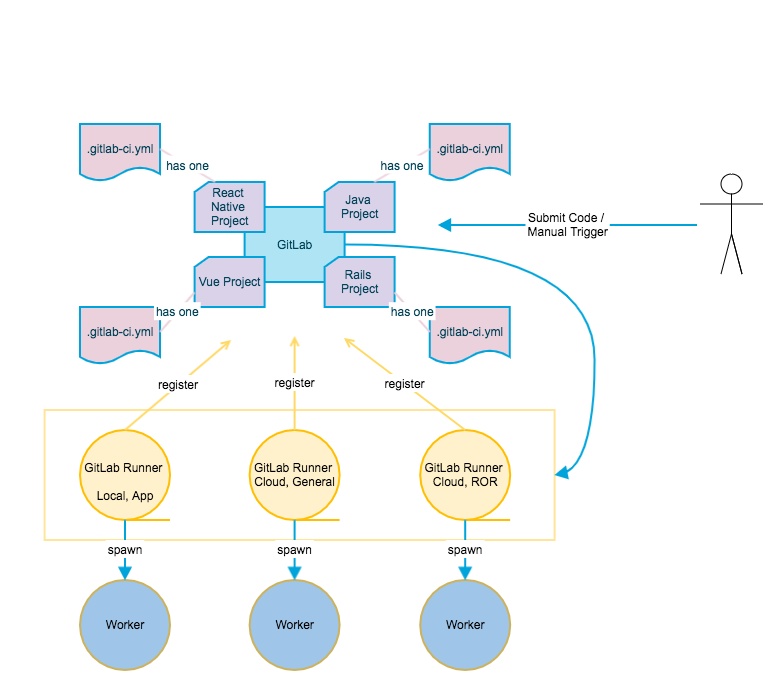

##  GitLab CI流程简介

    

粉色：

- GitLab的CI/CD由`.gitlab-ci.yml`文件配置
- 每个项目根目录可以配置一个`.gitlab-ci.yml`文件

橙色：

- CI/CD的具体任务由`GitLab Runner`负责调度执行
-  `GitLab Runner`需事先在`GitLab`注册才能被调用
-  `GitLab Runner`可以安装在实体机上，也可以通过Docker安装

蓝色：

- CI/CD过程可通过提交代码自动触发，也可以通过手动触发
- 触发后，GitLab根据`.gitlab-ci.yml`的配置通知相应的`GitLab Runner` 
-  `GitLab Runner`仅仅是一个任务调度器，不负责执行具体的任务
-  `GitLab Runner`收到通知后，根据`.gitlab-ci.yml`配置，生成相应的`Worker`来执行一系列具体的任务：编译、测试、打包、部署等
-  `Worker`可以是实体机，也可以是Docker

