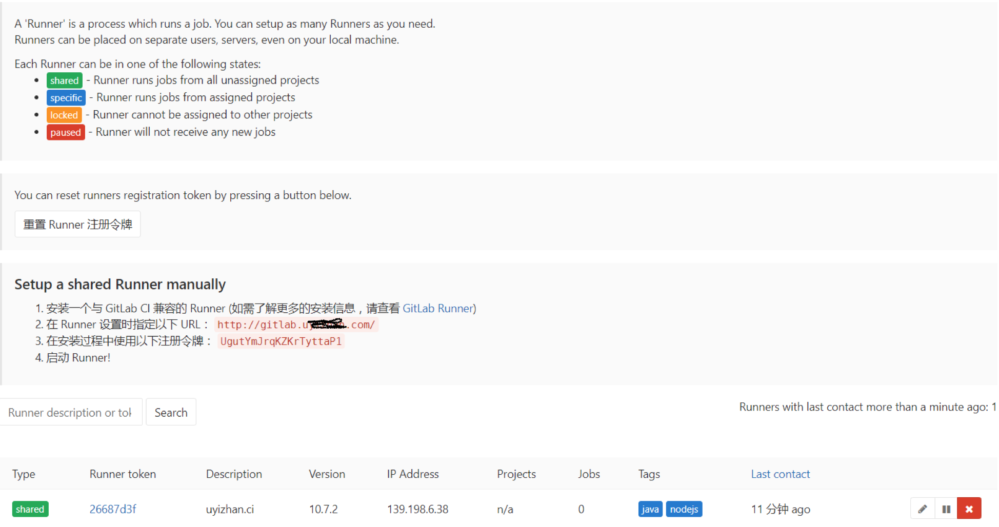

##  GitLab runner安装与注册
#### 创建gitlab runner目录
```shell
mkdir -p /opt/deploy/docker/gitlab-runner/config
#创建gitlab runner 工作目录
```

#### 启动gitlab runner容器
```shell
docker run --detach  \
    --name gitlab-runner \
    --restart always \
    --volume /opt/deploy/docker/gitlab-runner/config:/etc/gitlab-runner \   # 配置文件
    --volume /var/run/docker.sock:/var/run/docker.sock \  # 支持dind(Docker in Docker, 在Docker中构建Docker镜像)
    gitlab/gitlab-runner:alpine-v10.7.2
```
#### gitlab runner容器注册
```shell
  docker run --rm -t -i -v /opt/deploy/docker/gitlab-runner/config:/etc/gitlab-runner --name gitlab-runner-register gitlab/gitlab-runner:alpine-v10.7.2 register \
   --non-interactive \          #使用非交互式方式注册
   --executor "docker" \          # 任务执行环境
   --docker-image 172.25.200.7/runner/maven \    # 任务执行用的默认镜像，如果gitlab-ci指定则使用指定镜像
   --url "http://gitlab.xxx.com" \      # GitLab服务器地址
   --registration-token "UgutYmJrqKZKrTyttaP1" \   # GitLab注册Token，可在GitLab管理界面获得
   --description "xxx.ci" \     # GitLab Runner的一些描述
   --tag-list "nodejs,java " \     # 给GitLab Runner打上标签，配置文件可根据标签指定某个Runner来执行任务
   --run-untagged \       # 是否可以运行未指定标签的任务
   --locked="false" \      # 是否锁定到某个项目
   --docker-volumes /var/run/docker.sock:/var/run/docker.sock \ 
   --docker-volumes /usr/bin/docker:/bin/docker#使用绑定docker socket方式构建镜像
   --docker-volumes /opt/deploy/workspace:/share:rw      #挂载执行任务时工作目录
```
#### gitlab runner配置文件
```
vim config.toml
#注册成功后，可以看到在配置文件中看到注册的参数
concurrent = 1
check_interval = 0

[[runners]]
  name = "xxx.ci"
  url = "http://gitlab.xxx.com"
  token = "26687d3fb63795d5d55c1064d5ac61"
  executor = "docker"
  [runners.docker]
    tls_verify = false
    image = "172.25.200.7/runner/maven"
    privileged = true
    disable_cache = false
    volumes = ["/opt/deploy/workspace:/share:rw", "/cache"]
    shm_size = 0
  [runners.cache]

```
#### gitlab runner register

> 注册成功

[文档：GitLab Runner Install in docker](https://docs.gitlab.com/runner/install/docker.html)  
[文档：using docker build images](https://docs.gitlab.com/ee/ci/docker/using_docker_build.html)  
[文档：docker runner register](https://docs.gitlab.com/runner/register/index.html#docker)  