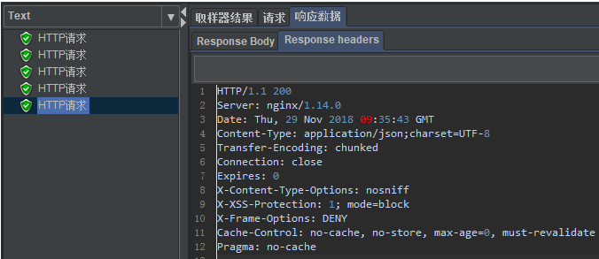
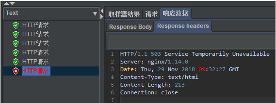
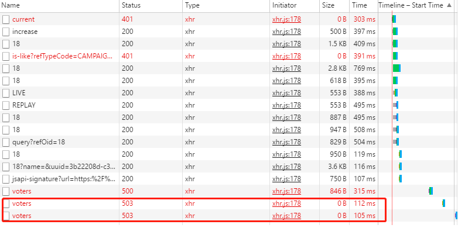

## Nginx limit限流配置

### 根据IP限制访问频率

```shell
http {
    limit_req_zone $binary_remote_addr zone=one:10m rate=5r/m;
    ...
}
#限制相同remote address访问频率每分钟5次

server {
   ...
   location /campaign/voters {
        limit_req zone=one burst=5 nodelay;
        proxy_pass http://172.20.30.202:8100;
   }

}
#如果超过访问频次限制的请求，可以先放到这个缓冲区里，如果缓冲区也满了，则返回503
```

Jmeter测试：



> 1min 5个请求



> 1min 6个请求

页面测试：



##### 总结
- limit_req zone=req_zone;
  - 严格依照在limti_req_zone中配置的rate来处理请求
  - 超过rate处理能力范围的，直接drop
  - 表现为对收到的请求无延时
- limit_req zone=req_zone burst=5;
  - 依照在limit_req_zone中配置的rate来处理请求
  - 同时设置了一个大小为5的缓冲队列，在缓冲队列中的请求会等待慢慢处理
  - 超过了burst缓冲队列长度和rate处理能力的请求被直接丢弃
  - 表现为对收到的请求有延时
- limit_req zone=req_zone burst=5 nodelay;
  - 依照在limit_req_zone中配置的rate来处理请求
  - 同时设置了一个大小为5的缓冲队列，当请求到来时，会爆发出一个峰值处理能力，对于峰值处理数量之外的请求，直接丢弃
  - 在完成峰值请求之后，缓冲队列不能再放入请求。如果rate=10r/s,且这段时间内没有请求再到来，则每6s缓冲队列就能恢复一个缓冲请求的能力，直到恢复能缓冲5个请求位置
  - 如果600r/m + 100burst,第一秒（600/60）+100,第二秒+（600/60）以此类推...