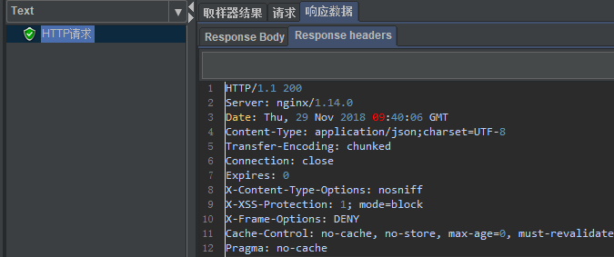
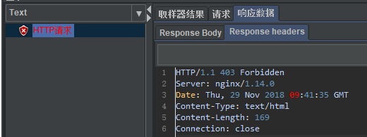
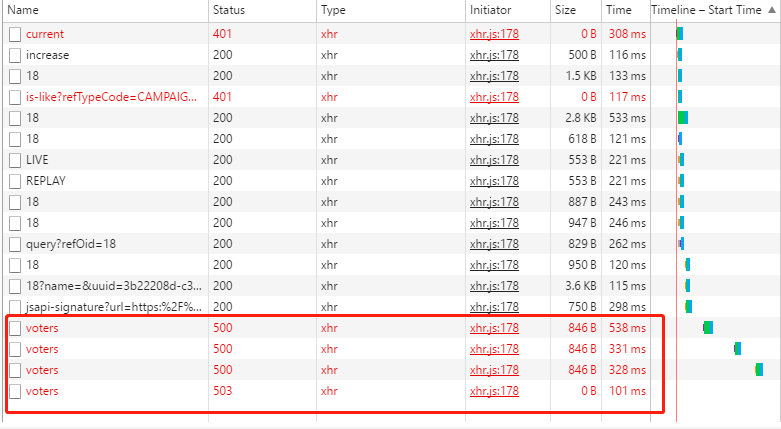
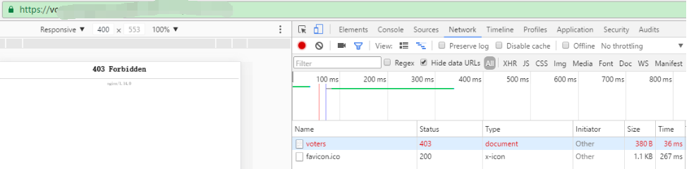

### 一、nginx配置仅允许指定referer访问
#### 1、Nginx Referer介绍
当一个请求头的**Referer**字段中包含一些非正确的字段,这个模块可以禁止这个请求访问

#### 2、valid_rederers指令
语法：valid_referers [none|blocked|server_names] …

默认值：no

使用字段：server, location

这个指令在referer头的基础上为 $invalid_referer 变量赋值，其值为0或1。

可以使用这个指令来实现防盗链功能，如果valid_referers列表中没有Referer头的值， $invalid_referer将被设置为1。

参数可以使如下形式：
- none 意为不存在的Referer头(表示空的，也就是直接访问，比如直接在浏览器打开一个图片)
- blocked 意为根据防火墙伪装Referer头，如：“Referer: XXXXXXX”。
- server_names 为一个或多个服务器的列表，0.5.33版本以后可以在名称中使用“*”通配符

#### 3、仅允许指定页面访问
```
server {
   location /campaign/voters {
        valid_referers *.uyizhan.com;  
              if ($invalid_referer) {  
              return 403; }  
        proxy_pass http://172.20.30.202:8100;
   }
}
```
**加referer测试**  
  
**不加referer测试**  

**页面正常请求**

**页面非正常请求**
  

[Nginx ngx_http_rederer_module文档](http://nginx.org/en/docs/http/ngx_http_referer_module.html)