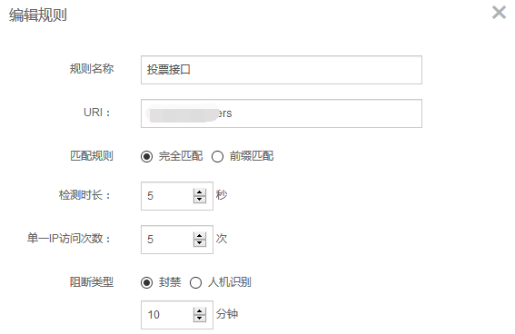
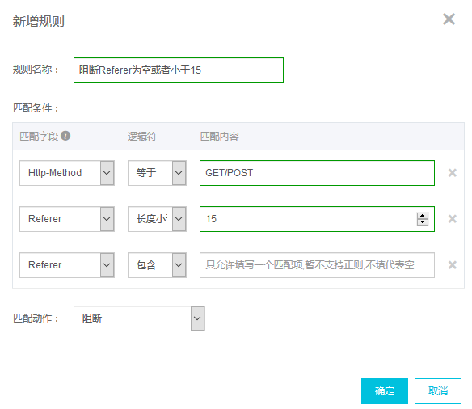
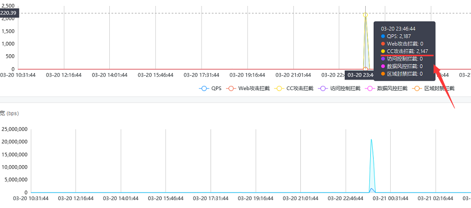
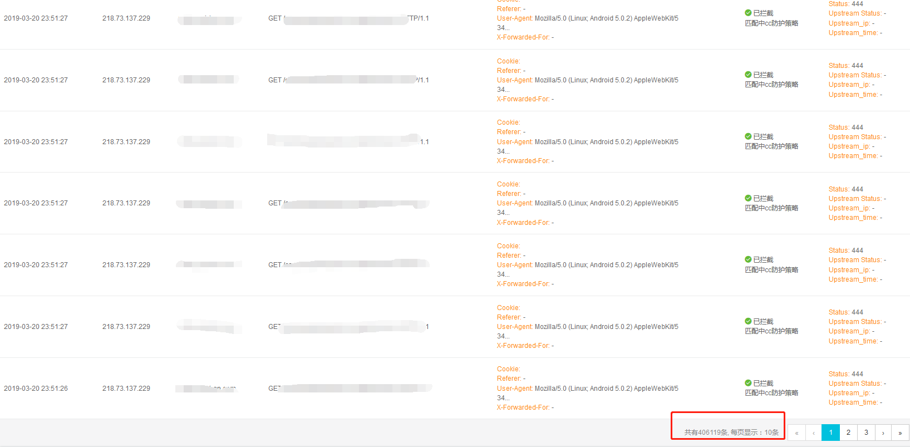

## Aliyun WAF接入配置

### 阿里云CNAME方式接入

阿里云WAF接入方式为CNAME接入，配置部署：

- 修改DNA CNAME记录，将xx.xx.com流量解析到阿里云WAF
- 配置阿里云WAF添加域名
- 上传HTTPS证书
- 验证流量，被转发至WAF
- 启用源站保护

### 配置CC攻击防护

配置指定具体接口，限制单一IP每5秒，访问限制5次，若超过访问频率则封禁IP十分钟

### 配置精准访问攻击防护

可日志字段，如URL、Referer、User-Agent、Http-method等，进行组合规则进行访问控制。

> 如上图，因测试发现会阻断正常流量中的`OPTION`请求，故仅对`GET`和`POST`请求进行Referer规格判断，长度小于指定字段和空Referer进行阻断

### 拦截效果

> 阻断大规模CC攻击

> CC攻击阻断日志

