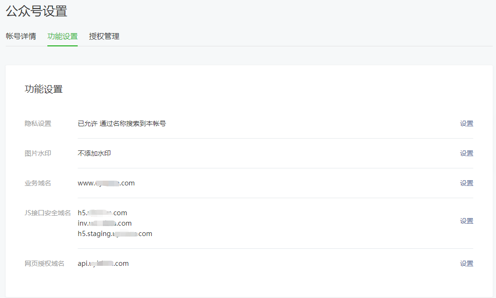
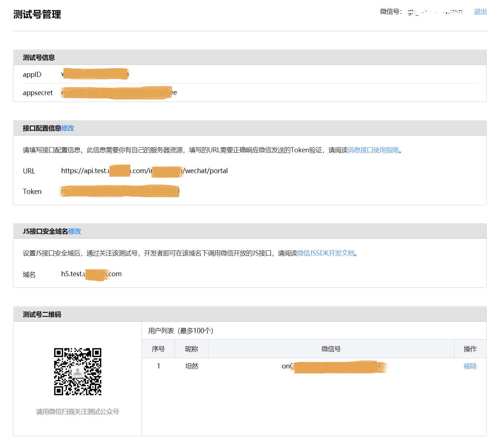

## 一、微信公众号配置测试环境分享

### 1、概述

公司共有dev、test、staging、prod四套环境。无奈微信公众号只允许配置三个JS接口安全域名。

如下图：

> 公众号设置 --> 功能设置
#### JS接口安全域名
需要公众号分享的域名，必须配置**JS接口安全域名**，配置的域名必须完成下面条件方可分享：
- 可填写三个域名或路径（例：wx.qq.com或wx.qq.com\/mp），需使用字母、数字及“-”的组合，不支持IP地址、端口号及短链域名。
- 填写的域名须通过ICP备案的验证
- 将文件MP_verify_9UsNAfdTDi9NJuYz.txt（点击下载）上传至填写域名或路径指向的web服务器（或虚拟主机）的目录（若填写域名，将文件放置在域名根目录下，例如wx.qq.com\/MP_verify_9UsNAfdTDi9NJuYz.txt；若填写路径，将文件放置在路径目录下，例如wx.qq.com\/mp/MP_verify_9UsNAfdTDi9NJuYz.txt），并确保可以访问。
> 建议将MP_verify_9UsNAfdTDi9NJuYz.txt同代码一起发布到项目中

问题来了，还有一套环境如果想做微信公众号分享测试，肿么办呢？

### 2、配置公众平台测试账号

微信公众号允许配置最大100个测试微信号访问公众测试内容

>  开发者工具 --> 公众平台测试账号 --> 测试号管理

如下图：

配置参数详解：

- wechat.mp.appId ：测试号信息自动生成
- wechat.mp.appSecret ： 测试号信息自动生成
- wechat.mp.token ：自定义
- JS接口安全域名：微信公众号需要分享内容的域名地址
- wechat.mp.aesKey ： 基础配置 --> 消息加解密密钥
- wechat.mp.accessTokenUrl : https://后台调用微信分享的接口

> 用户列表中就是可以访问测试公众号内容的微信

